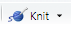
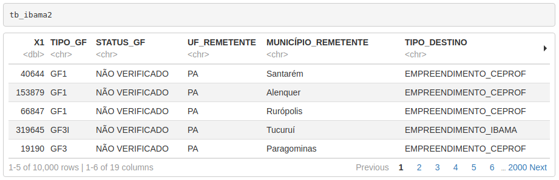

# Módulo IV {#m4}

## Manipulação de _strings_ no R com `stringr`

### Introdução

O pacote `stringr`, como o próprio nome já diz é um pacote para manipulação de _strings_ e também de expressões regulares. Essas duas técnicas são muito importantes em análise de dados, pois muitas vezes vamos lidar com trechos de textos e colunas de caracteres, onde precisamos encontrar padrões de palavras, números, e-mails, telefones, nomes, etc.

Todo o conteúdo referente ao pacote `stringr` estará baseado na página de introdução ao pacote, disponível em [http://stringr.tidyverse.org](http://stringr.tidyverse.org). Será como uma tradução selecionada e mais amigável do conteúdo disponibilizado pelos autores. Se você desejar se aprofundar mais sobre o assunto, pode recorrer ao livro [**R for Data Science**](https://www.r4ds.co.nz) de Hadley Wickham.

Existem quatro famílias principais de funções no pacote `stringr`:

* 1. manipulação de caracteres: essas funções nos permite manipular caarcteres individuais dentro de strings e dentro de vetores;

* 2. ferramentas para lidar com espaços em branco, com as quais poderemos adicionar, remover e manipular espaços em branco;

* 3. operações sensíveis ao local do usuário (_locale sensitive_) - essas operações variam dependendo do local considerando o alfabeto utilizado em cada país;

* 4. funções de _pattern matching_ - essas funções reconhecem 4 "motores" de descrição de padrões. A mais comum são expressões regulares, a qual usaremos neste curso.

### Operações com caracteres individuais

#### Obtendo e modificando caracteres

```{r}
# carregamento
library(stringr)
```


Para obter o tamanho de uma string use *string_length()*:
```{r}
str_length("abc")
```

Para acessar caracteres individuais (posições) ou partes de uma string, podemos usar `sub_str()`. Esta função recebe como argumentos um vetor de caracteres, uma posição de início e uma posição final. Ambas as posições podem receber um número inteiro positivo ou um inteiro negativo. No caso de a posição passada ser um inteiro positivo, a contagem de posições é feita da esquerda para a direita (do início da string) até se atingir a posição desejada. Quando a posição passada como argumento é um inteiro negativo, a contagem é feita da direita para esquerda (do final da string) até se atingir a posição. Em ambos os casos a forma de avaliação da posição é **inclusiva**, ou seja, inclui o número que foi passado. Caso as posições passadas ultrapassem os limites da _string_, o resultado é truncado sem retornar qualquer *warning*.

```{r}
x <- c("abcdef", "ghifjk")

# extraindo 3ª letra
str_sub(x, 3, 3)
```

```{r}
# do segundo ao penúltimo caractere
str_sub(x, 2, -2)
```

`str_sub()` também pode ser usada para modificar _strings_:

```{r}
str_sub(x, 3, 3) <- "X"
x
```

Para duplicar strings individuais, use `str_dup()`:

```{r}
str_dup(x, c(2, 3))
```

#### Espaços em branco

As funções a seguir adicionam, removem ou modificanm espaços em branco existentes nas _strings_.

1. `str_pad()` preenche uma string com espaços em branco até uma largura fixa. Os espaços em branco podem ser adicionados à esquerda, direita ou em ambos os lados. Esse tipo de função é bastante útil para gerar arquivos do tipo `.fwf`, ou seja com larguras/tamanhos fixos para as colunas.

```{r}
x <- c("abc", "defghi")
str_pad(x, 10)
```

```{r}
str_pad(x, 10, "right")
```

```{r}
str_pad(x, 10, "both")
```

Podemos ainda preencher a _string_ com outros elementos ao invés de espaços em branco:
```{r}
str_pad(x, 10, "both", pad="@")
```

``str_pad()`` nunca encurtará uma _string_:
```{r}
str_pad(x, 4)
```


Observação: Se você quiser assegurar que as _strings_ possuem o mesmo tamanho, combine `str_pad()` com `str_trunc()`:

```{r}
x <- c("Curto", "Esta é uma string longa")

str_trunc(x, 10)

str_pad(x, 10)

# x %>% 
#   str_trunc(10) %>% 
#   str_pad(10, "right")
```


2. O oposto de `str_pad()` é `str_trim()`, que remove os _leading_ e _trailing_ _spaces_:
```{r}
x <- c("  a   ", "b   ",  "   c")
str_trim(x)
```

```{r}
str_trim(x, "left")
```


3. Podemos usar `str_wrap()` para modificar espaços em branco já existentes de forma a "envelopar" por exemplo um parágrafo de texto para que o comprimento de cada linha seja o mais similar possível. É como se justificássemos o parágrafo.
```{r}
blah_blah_blah <- str_c(
  "`Rosas são vermelhas, ",
  "Violetas são azuis, ",
  "... Em qualquer combinação de palvras ",
  " str_wrap te dá uma luz  "
)
# uma alternativa a c() para strings
```

```{r}
cat(str_wrap(blah_blah_blah, width = 40))
# cat0 é uma alternativa a print
```

#### Locale sensitive

Uma boa parte das funções do pacote `stringr` são _locale sensitive_: elas vão se comportar de diferente dependendo do país/região em que o usuário se encontra.

Veja exemplos de funções que transformam letras de caixa baixa para caixa alta e vice-versa:

```{r}
x <- "I like horses."
str_to_upper(x)
```

```{r}
str_to_title(x)
```

```{r}
str_to_lower(x)
```

```{r}
# Veja o caso do idioma turco em que há dois tipos de i: um com "ponto" e outro sem
str_to_lower(x, "tr")
```


Ordenando _strings_ e seus índices:

```{r}
x <- c("y", "i", "k")
str_order(x) # índices
```

```{r}
str_sort(x)
```

```{r}
# No idioma da Lituânia, y está entre as letras i and k
str_sort(x, locale = "lt")
```

Um aspecto importante é que a configuração _default_ de `stringr` sempre vem com o idioma em inglês para garantir um comportamento idêntico em qualquer sistema ao se utilizar as funções genéricas. Isso é diferente do que normalmente ocorre com `base R`, onde a opção global _locale_ normalmente varia com a versão regional do sistema operacional e gera bastante confusão quando vamos desenvolver programas.

Para obtermos uma lista das abreviações e regiões disponíveis, é só executarmos `stringi::stri_locale_list()`.

### _Pattern matching_

A vasta maioria das funções de _stringr_ funciona com padrões. Estas funções são parametrizadas pelo tipo de tarefa que elas executam e para quais padrões elas fazem o _matching_ ou pareamento.

#### _Tasks_

Cada função de _matching_ possui os mesmos dois primeiros argumentos: um vetor de _strings_ para processar e um padrão para fazer o pareamento. O pacote `stringr` disponibiliza algumas funções para: detectar `str_detect()`; localizar `str_locate()`; extrair `str_extract()`; parear `str_match()`, substituir `str_replace()`; e separar strings `str_split()`.
<!-- São as funções **detect**, **locate**, **extract**, **match**, **replace** e **split** -->

Veja um exemplo com algumas _strings_ e uma Expressão Regular para encontrar números de telefone (dos EUA):
```{r}
strings <- c(
  "apple", 
  "61 2022 5369", 
  "61-2020-8753", 
  "Trabalho: 61-2022-5835; Home: 19.3237.5344"
)
phone <- "([1-9]{2})[- .]([0-9][0-9]{3})[- .]([0-9]{4})"
```

- `str_detect()` detecta a presença ou ausência de um padrão e retorna um vetor lógico. 

- `str_subset()` retorna os elementos de um vetor de caracteres que fazem a correspondência (_matching_) com uma expressão regular.

Para sabermos as posições das _strings_contém números, podemos fazer:

```{r}
# Quais strings contém números
str_detect(strings, phone)
```


```{r}
str_subset(strings, phone)
```

- `str_count()` conta o número de correspondências. Para saber quantos números de telefone há em cada _string_, podemos fazer:

```{r}
str_count(strings, phone)
```


- `str_locate()` localiza a primeira posição do padrão procurado de cada string (elemento) presente no vetor e retorna uma **matriz** numérica com colunas indicando as posições de começo e fim.

- `str_loacte_all()` localiza todas as correspondências, retornando uma **lista** de matrizes numéricas.

Em qual posição de cada _string_, os números de telefone estão localizados?

```{r}
(loc <- str_locate(strings, phone))
```

```{r}
str_locate_all(strings, phone)
```

- `str_extract()` extrai o texto correspondente à **primeira correspondência** dentro da _string_, retornando um **vetor de caracteres**. 

- ``str_extract_all()`` extrai todos os _matches_ e retorna uma **lista** de vetores de caracteres.

```{r}
str_extract(strings, phone)
```

```{r}
str_extract_all(strings, phone)
```

Note que com `str_extract_all()`, conseguimos identificar exatamente em que posição do vetor original cada string estava.

```{r}
str_extract_all(strings, phone, simplify = TRUE)
```


- `str_match()` extrai grupos de captura de expressões regulares formados por `()` apenas para a primeira correspondência. 

- `str_match_all()` extrai grupos de captura de todos os _macthes_ e retorna uma lista de matrizes de caracteres.

```{r}
# Pull out the three components of the match
str_match(strings, phone)
```

```{r}
str_match_all(strings, phone)
```


- `str_replace()` substitui a **primeira ocorrência** em que houve _matching_ e retorna um vetor de caracteres. 
- `str_replace_all()` substitui todos os _matches_.

<!-- ESSAS SÃO AS EQUIVALENTES A SUB E GSUB!!! MOSTRAR COMO FAZER UMA FUNÇÃO PARA SUBSTITUIÇÃO DE "," E "."
OU PASSAR COMO EXERCÍCIO DA AULA-->


Esta e uma função muito interessante de se usar quando estamos trabalhando com dados identificados e desejamos esconder CPF's, RG's, números de telefone, etc. Veja um exemplo com os números de telefone.

```{r}

str_replace(strings, phone, "XX-XXXX-XXXX")
```


```{r}
str_replace_all(strings, phone, "XX-XXXX-XXXX")
```


- `str_split_fixed()` divide a _string_ em um número fixo de partes baseado no padrão passado como argumento e retorna uma **matriz** de caracteres. 

- `str_split()` separa uma _string_ em um número variável de partes e retorna uma **lista** de vetores de caracteres.

```{r}
str_split("a-b-c", "-")
```

```{r}
str_split_fixed("a-b-c", "-", n = 2)
```

#### Índices e _matching_:


`str_subset()` permite extrair elementos de um vetor de _strings_, caso ele contenha o caractere ou grupo de caracteres informado.

<!-- - `str_subset()` é uma função envelope de `x[str_detect(x, pattern)]` -->
<!-- and is equivalent to grep(pattern, x, value = TRUE). -->

```{r}
fruit <- c("apple", "banana", "pear", "pinapple")
str_subset(fruit, "a")

```


`str_which()` retorna a posição do vetor-alvo, em que foi encontrada correspondência para um determinado caractere ou conjunto de caracteres informados.
<!-- - `str_which()`, por sua vez é uma função envelope de ``which(str_detect(x, pattern))``. -->
<!-- and is equivalent to grep(pattern, x). -->


```{r}
str_which(LETTERS, "F")
# str_which(LETTERS, "F|Y")
```

### Referências da seção

- Wickham, H. (2019). _stringr: Simple, Consistent Wrappers for Common String Operations_. R package version 1.4.0. [https://CRAN.R-project.org/package=stringr](https://CRAN.R-project.org/package=stringr).

- ____. (2020). _stringr vignette: _Introduction_. URL [http://stringr.tidyverse.org](http://stringr.tidyverse.org)

- Wickham, H.; Grolemund, G. (2016). _R for Data Science: Import, Tidy, Transform, Visualize, and Model Data_. O'Reilly Media. december 2016. 522 pages. Disponível em: [www.r4ds.co.nz](www.r4ds.co.nz)

- Estatística Computacional 2 (2015). _Notas de aula_. Curso de graduação em Estatística. UnB. 1º semestre, 2015.


***
***


## Expressões Regulares (REGEX)

### Introdução

As linguagens de programação possuem mais de um tipo de mecanismo de busca de padrões em _strings_. Expressões regulares é o mecanismo mais utilizado. Por isso, será o nosso foco neste curso. No entanto, saiba que o pacote _stringr_ também traz implementações dos outros 3 tipos, os quais descrevemos abaixo:

- _Fixed bytewise matching_ com a função `fixed()`;
- _Locale-sensitive_ correspondência de caracteres com `coll()` (_collation search_);
- _Text boundary analysis_ com a função `boundary()`.

Se você se interessar pelo assunto, pode buscar mais informações na documentação do pocote `stringr`.

Mas o que seriam exatamente, então, **Expressões Regulares**?

Expessões Regulares são formas concisas e flexíveis para descrever padrões (que estamos buscando) em _strings_. Nesta seção, nós vamos descrever os principais aspectos relacionados a construção de expressões regulares. Para isso utilizaremos alguns dos exemplos descritos nas [_vignettes_](http://stringr.tidyverse.org/articles/regular-expressions.html) do pacote `stringr` e parte de minhas notas de aula do Curso de Computação Estatística da UnB. 

Primeiro faremos uma introdução geral sobre expressões regulares e depois veremos exemplos utilizando o pacote `stringr`.

Por que **expressões regulares** são importantes?

Expressões regulares nos permitem descrever em termos mais gerais o que desejamos buscar em uma _string_. Normalmente, é mais eficiente usarmos expressões regulares, porque se buscarmos caracteres simples, só obteremos a correspondência exata para aquele caractere. Já pensou em como faríamos para buscar apenas números de telefone, endereços de e-mail, CNPJ's ou CPF's no meio de dados (por exemplo páginas da internet) que não estão exatamente organizados em colunas?

Cabe ressaltar que expressões regulares é uma técnica usada praticamente em todo o mundo da programação. Não é uma particularidade somente da linguagem **R**.

As expressões regulares (regex), em geral, são construídas da combinação de 3 componentes:

* 1) _literal characters_: que somente vão sofrer _matching_ se houver nos dados caracteres literais idênticos;

* 2) _character classes_: que permitem o _matching_ por múltiplos caracteres - são compostas de caracteres dentro de dois colchetes `[ ]`;

* 3) _modifiers_ ou _anchors_: que vão operar nos caracteres, nas classes e em combinações dos dois.

### Exemplos de REGEX usando `stringr`

#### Correspondências literais (_basic match_/_literal characters_)

O padrão mais simples para fazer o _matching_ é:

```{r}
x <- c("maçã", "banana", "pêra")
str_extract(x, "an")
```

Podemos ignorar letras maiúsculas e minúsculas com `ignore_case = TRUE`:

```{r}
bananas <- c("banana", "Banana", "BANANA")
str_detect(bananas, "banana")

str_detect(bananas, regex("banana", ignore_case = TRUE))


```

Seguindo com os exemplos, o próximo passo é conhecermos o papel desempenhado por `.`. Sua função é buscar qualquer caractere com exceção de uma nova linha (`\n`):

```{r}
str_extract(x, ".a.")
```

Mas se você quiser encontrar até mesmo caracteres que indicam uma nova linha, pode "setar" `dotall = TRUE` dentro da função responsável pelo mecanismo de _matching_, que é a função `regex()`:

```{r}
str_detect("\nX\n", ".X.")
str_detect("\nX\n", regex(".X.", dotall = TRUE))
```


#### _Escaping characters_ ou caracteres de escape

Se `.` faz o _matching_ de qualquer caractere, como podemos fazer o _matching_ literal de um ponto "." nos dados? Teremos de usar um caractere de escape para dizer ao **R** que queremos um **_matching_ literal** e não usar o comportamento especial de `.`. Em REGEX, utiliza-se uma barra invertida `\` para tal fim. 

Então, para buscarmos um simples "." nos dados, usamos `\.`. Mas há um porém: a barra invertida também é tratada como um caractere especial no **R** quando se trata de strings_. Portanto, teríamos que acrescentar outra barra invertida formando a string `\\.` de modo a fazermos o *matching* com um simples ponto nos dados.

```{r}
dot <- "\\."

# Mas veja que como REGEX, existe somente uma barra: \.
writeLines(dot)

# Isso diz ao R para buscar explicitamente um ponto
str_extract(c("abc", "a.c", "bef"), "a\\.c")
```

Para te ajudar a entender quantas barras você precisará escrever no código, vamos pensar que existem dois mecanismos diferentes: o interpretador do **R** e o mecanismo do REGEX. Quando você envia uma expressão regular para o interpretador, ele passará por um filtro em que serão aplicadas as regras do **R**. Passado esse primeiro filtro, a expressão segue para uma nova instância, onde sofrerá ação do mecanismo de REGEX. 

Pense nessas etapas como um pedágio. Para cada barra invertida que precisa chegar na última etapa do pedágio, você precisa também de uma barra `\` para "pagar o pedágio" da primeira etapa. As barras invertidas `\`, são, portanto, a sua moeda de troca e você não pode levar nem mais nem menos "dinheiro" do que precisa. Se a expressão tem que chegar na etapa de REGEX como `\.`, para que a última barra seja encarada como um caractere especial que descaracteriza o funcionamento especial do `.`, fazendo assim um _matching_ literal, você precisa enviar uma barra `\` a mais para que seja consumida na etapa do interpretador do **R**. Por isso, no seu código, você deve escrever `\\.`. 

<!-- HAAHAHHAHAH NO RMARKDOWN AINDA TENHO QUE USAR 5 PARA IMPRIMIR DUAS !!! se nao for entre ``-->


Já pensou, então, em como faríamos para fazer o _matching_ literal de uma barra invertida em uma _string_?

Vamos pensar novamente como um pedágio, começando da última etapa para primeira. No mecanismo de REGEX, última etapa do pedágio, a expressão deve chegar com duas barras `\\`: a da esquerda fazendo função de caractere especial, que elimina a função especial da barra da direita. Portanto, para carregar duas barras até o final do processo, você precisa de outras duas barras `\\` para serem consumidas na etapa do interpretador do **R**. Portanto, para fazer o _matching_ literal de uma barra invertida em uma string, seu código deve ser escrtio como `\\\\`.

O que acontece, na verdade, é que o interpretador separa cada par de barras, fazendo com que a da esquerda tire o funcionamento especial da barra da direita em cada par. Desta forma, chegam apenas duas barras no mecanismo de REGEX.

```{r}
x <- "a\\b"
writeLines(x)
```

```{r}
str_extract(x, "\\\\")
```


<!-- An alternative quoting mechanism is \Q...\E: all the characters in ... are treated as exact matches. This is useful if you want to exactly match user input as part of a regular expression. -->

<!-- x <- c("a.b.c.d", "aeb") -->
<!-- starts_with <- "a.b" -->

<!-- str_detect(x, paste0("^", starts_with)) -->
<!-- #> [1] TRUE TRUE -->
<!-- str_detect(x, paste0("^\\Q", starts_with, "\\E")) -->

<!-- PULEI A PARTE DE CIMA -->

A partir de agora, quando formos nos referir à expressões regulares, usaremos a forma apenas com uma `\`. No entanto, saiba que em seu código nas funções do **R**, você deverá adicionar mais uma barra invertida `\\`.

#### Matching de múltiplos caracteres (classes)

Primeiro, veremos alguns atalhos para classes de caracteres:

```{r, echo = FALSE}
df<-data.frame("atalhos"=c("\\\\w","\\\\W","\\\\d","\\\\D","\\\\s","\\\\S"),
               "classes"=c("alfanuméricos e _ (qualquer palavra)",
                           "não-alfanuméricos (qualquer coisa diferente de palavras e _)",
                           "digitos",
                           "não-dígitos",
                           "espaço",
                           "não-espaço"))
knitr::kable(df)
```

<!-- TEM QUE COLOCAR DUAS BARRAS NAS STRINGS PARA SAIR UMA NESSE CASO TB -->

Passemos aos exemplos:

```{r}
str_extract_all("Don't eat that!", "\\w+")[[1]]

str_split("Don't eat that!", "\\W")[[1]]
```

```{r}
str_extract_all("1 + 2 = 3", "\\d+")[[1]]
```

```{r}
(text <- "Texto  \t com\n\t\tespaçamento \f ruim")
str_replace_all(text, "\\s+", " ")
```


Um outro atalho interessante é `\b` que busca por limites/bordas de palavras, ou seja, transições entre caracteres de palavras e caracteres de não-palavras. `\B` faz o oposto.

```{r}
str_replace_all("The quick brown fox", "\\b", "_")

str_replace_all("The quick brown fox", "\\B", "_")
```

Você pode consultar outros atalhos interessantes nesta [vignette](http://stringr.tidyverse.org/articles/regular-expressions.html) do pacote `stringr`.

Há a possibilidade, ainda, de criarmos nossas próprias classes usando `[]`:

* `[abc]`: busca a correspondência de a, b ou c;
* `[a-z]`: busca qualquer caractere minúsculo entre **a** e **z**;
* `[A-Z]`: busca qualquer caractere maiúsculo entre **A** e **Z**;
* `[^abc]`: busca qualquer coisa exceto **a**, **b**, ou **c**;
* `[\^\-]`: busca `^` ou `-`. Lembre-se de adicionar mais uma barra invertida na frente de cada uma das barras ao passar o comando no **R**)

<!-- NA VIGNETTE DO STRINGR, há um erro para o exemplo [\^\-] -->

<!-- FAZER EXEMPLOS NA AULA!! -->

Há ainda diversas classes pré-construídas que podemos usar com os colchetes:

* `[:punct:]`: pontuação;

* `[:alpha:]`: letras;

* `[:lower:]`: letras minúsculas;

* `[:upper:]`: LETRAS MAIÚSCULAS; 

<!--AQUI A UM ERRO TB NA VIGNETTE - ELE ESCREVE UPPER CLASS -->

* `[:digit:]`: digitos;

* `[:alnum:]`: letras e números.

* `[:cntrl:]`: caracteres de controle.

* `[:graph:]`: letras, números e pontuação.

* `[:print:]`: letras, números, pontuação e espaço em branco.

* `[:space:]`: caracteres de espaço (equivalente a `\s`).

* `[:blank:]`: espaço e tab.

Essas expressões vão dentro de outros colchetes:

```{r}
y <- c(1234, "R", "IPEA", " ", "Olá, tudo bem ?")
str_extract_all(y, "[[:digit:]]")

str_extract_all(y, "[[:digit:]á]")

str_extract_all(y, "[[:digit:]td]")

str_extract_all(y, "[b[:upper:]m]")

```


#### Operador _Alternation_

`|` é o operador de alternância que permite escolher entre uma ou mais correspondências possíveis. ``abc|def`` vai fazer o _matching_ com ``abc`` ou ``def``.

```{r}
str_detect(c("abc", "def", "ghi"), "abc|def")
```

#### Agrupamento

Parenteses podem servir para alterar regras de precedência ou formar grupos. O mesmo que vimos no Módulo \@ref(m1) para alterar regras de precedência serve para REGEX:

```{r}
str_extract(c("grey", "gray"), "gre|ay")

str_extract(c("grey", "gray"), "gr(e|a)y")

```


Parênteses definem grupos e podemos retro-referenciar esses grupos utilizando `\Nro_do_grupo` para indicar que os grupos podem se repetir mais vezes, bem como a ordem na qual se repetiriam na _string_. 

```{r}

pattern <- "(1|2)(3|4)\\1"

combinacoes <- list("1213", "1413", "2324", "1111", "2222", "1415", "1313", "1331")

combinacoes %>%
  str_subset(pattern)

pattern2 <- "(1|2)(3|4)\\1\\2"

combinacoes %>%
  str_subset(pattern2)

pattern3 <- "(1|2)(3|4)\\2\\1"

combinacoes %>%
  str_subset(pattern3)

# OU 

# combinacoes %>%
#   str_subset(pattern) %>%
#   str_match(pattern)

```


#### Âncoras ou modificadores

Ancorar significa estabelecer um padrão para o início ou final da *string* que estamos buscando.

* `^` busca o padrão no começo da _string_;
* `$` busca o padrão no final da _string_.

```{r}
x <- c("maçã", "banana", "pêra")
str_extract(x, "^m")

str_extract(x, "a$")

```


#### Repetições

Pode-se controlar quantas vezes um padrão aparece em determinada parte da _string_ com:

* `?`: 0 ou 1.
* `+`: 1 ou mais.
* `*`: 0 ou mais.

```{r}
x <- "1888 é o ano mais longo em algarismos romanos: MDCCCLXXXVIII"
str_extract(x, "CC?")


str_extract(x, "CC+")


str_extract(x, 'C[LX]+')

str_match("banana", '(na)+')

```

Podemos especificar o número exato de repetições que esperamos com:

* `{n}`: exatamente $n$ vezes;
* `{n,}`: $n$ vezes ou mais;
* `{n,m}`: entre $n$ e $m$ vezes.

```{r}
str_extract(x, "C{2}")

str_extract(x, "C{2,}")


str_extract(x, "C{2,3}")


```


Há diversos outros padrões e expressões que podem ser usadas. Busque `??stringi_search-regex` ou visite o site de `stringr`.

***

### Referências da seção

- Wickham, H. (2019). _stringr: Simple, Consistent Wrappers for Common String Operations_. R package version 1.4.0. [https://CRAN.R-project.org/package=stringr](https://CRAN.R-project.org/package=stringr).

- ____. (2020). _stringr vignette: _Introduction_. URL [http://stringr.tidyverse.org](http://stringr.tidyverse.org)

- Wickham, H.; Grolemund, G. (2016). _R for Data Science: Import, Tidy, Transform, Visualize, and Model Data_. O'Reilly Media. december 2016. 522 pages. Disponível em: [www.r4ds.co.nz](www.r4ds.co.nz)

- Estatística Computacional 2 (2015). _Notas de aula_. Curso de graduação em Estatística. UnB. 1º semestre, 2015.


***
***

## Relatórios e pesquisa reproduzível com `rmarkdown`


### Introdução

Chegamos a um ponto do curso em que já possuímos um ferramental poderoso para analisar e tratar dados. No entanto, nos dias atuais, há uma outra etapa tão importante quanto as anteriores na Ciência de Dados: compartilhar e comunicar suas análises.

Para este objetivo, o **R** certamente é a ferramenta mais poderosa nos dias atuais: você pode integrar desde a etapa de análise de dados até o compartilhamento de seus códigos, gráficos e constatações por meio de relatórios, slides, artigos em $\TeX$ e até mesmo livros. Esta apostila mesmo foi toda confeccionada dentro da linguagem **R**.

Nesta seção, vamos focar na produção de relatórios. Veremos também como confeccionar esses relatórios de modo que eles se adequem automaticamente a mudanças nos dados que originam sua análise. Além dessa questão prática, todos os dados e códigos utilizados numa análise podem ser compartilhados com sua equipe, o que reforça o carater de reproducibilidade da linguagem **R**. Qualquer outra pessoa poderá facilmente replicar e verificar/validar os resultados obtidos por você.

A ferramenta que nos permite fazer a maioria dessas coisas que citamos acima é o pacote `rmarkdown`. Ele é um pacote que gravita em torno do _core_ do `tidyverse`. O `rmarkdown` une escrita de texto e de códigos num único lugar, por meio de linaguagem de marcação (markdown). A linguagem de marcação possui uma sintaxe bastante simples e que torna a produção de texto bem ágil, diferentemente do que ocorre com $HTML$ e $\LaTeX$, por exemplo. Isso faz com que você não precise sair do RStudio ou mesmo trocar de janela ou abas para incluir texto, figuras, _outputs_ ou pedaços (_chunk_) de códigos em um documento do tipo R Markdown. O pacote `rmarkdown` é tão supreendente que a partir dele surgiram pacotes derivados que permitem a criação de sites e blogs com `blogdown` (veja [https://allanvc.github.io](https://allanvc.github.io)) e a confecção de livros e apostilas como esta que você está lendo por meio do pacote `bookdown`, além de outros.

Para começar a confecionar um relatório em R Markdown, você precisa criar um novo arquivo do tipo `.Rmd`. Clique em , como você normalmente faz para criar um _script_, só que, desta vez selecione "R Markdown" .

Uma nova janela será aberta no RStudio, em que você deverá escolher que tipo de arquivo de _output_ deseja, se `HTML`, `PDF` ou `.docx`, bem como seu nome e o título do seu relatório. Vamos escolher `PDF`.


Note que automaticamente será criada uma nova aba no RStudio, com um modelo de relatório `.Rmd` pré-formatado.

**ATENÇÃO:** Se esta for sua primeira vez utilizando R Markdown no Windows, o próprio RStudio irá oferecer a instalação de alguns pacotes necessários (e suas dependências) para rodarmos o `rmarkdown`. Dentre eles estará o pacote `tinytex`. Trata-se de um pacote que realiza a instalação mínima de bibliotecas $\LaTeX$ necessárias para a geração de documentos `.pdf` a partir do R Markdown. Após a instalação dos pacotes, basta executar no console o código abaixo e depois reiniciar sua sessão do RStudio.

```{r, eval=FALSE}
tinytex::install_tinytex()
```


Na aba criada, estão todos os dados que você informou anteriormente e também uma série de exemplos criados automaticamente retratando o funcionamento de um simples relatório em R Markdown. Note que todo o texto é editável.


Os documentos são gerados utilizando o pacote `knitr`. Este pacote funciona como um pacote de apoio de `rmarkdown`, mas você não precisa conhecê-lo a fundo. _Knit_ em inglês significa tricotar ou unir. E é justamente isso que ele faz, ele costura e une todos os elementos que você vier a construir ou programar com R Markdown. Se você já quiser gerar um relatório a partir do exemplo apresentado a você ao criar um novo arquivo `.Rmd`, você podê fazê-lo clicando no botão _Knit_  na janela do RStudio. Após escolher um nome e salvar seu arquivo `.Rmd`, se você escolheu a opção `PDF`, você terá um arquivo de extensão `.pdf`. Faça testes alterando os arquivos de destino: `.html` e `.docx` direto no botão `Knit`.

**DICA:** A cada comando novo que você aprender ao longo dessa seção, sugerimos gerar um novo relatório, de modo que você possa companhar as modificações feitas no documento. Por isso, sugerimos também que você apague todo o conteúdo do relatório de sugestão criado ao abrir um novo documento `.Rmd`, mantendo somente os dados do cabeçalho: `title`, `author`, `date` e `output`.


### Cabeçalho

No cabeçalho você pode especificar todos os aspectos técnicos de formatação do seu texto em R Markdown. Existem diversas opções, mas focaremos nas mais básicas que são as que aparecem na tela neste momento.

* `title` contém o título de seu documento;

* `author` o seu nome;

* `date` a data de geração do documento;

* `output` o tipo de documento a ser gerado, se HTML, PDF ou Word.


**Alguns truques úteis:**

* Caso você queira acrescentar um co-autor, use:
```{rmarkdown}
author:
  - Nome do Autor1
  - Nome do Autor2
```

* Para adicionar um subtítulo, basta escrever:
```{rmarkdown}
title: "Seu Título"
subtitle: "Subtítulo para o relatório"
```

* Para não ter que ficar alterando a data manualmente, toda vez que você executa o _Knit_, utiliza a função `format()` em conjunto com `Sys.time()`. Note que esse código é passado entre sinais de crase ` `` `.

```{rmarkdown}
date: "`r format(Sys.time(), '%d %B %Y')`"
```

### Formatação de Texto

A sintaxe de formatação de texto do R Markdown é muito simples. Por isso a produção de textos com ele é muito rápida. Isso vem com o custo de não se ter tanta flexibilidade de alteração de elementos textuais como numa linguagem como $\LaTeX$, mas ainda sim, as possibilidades de formatação são bem consideráveis.

#### Títulos

O símbolo `#` é utilizado para definir títulos. A cada `#` acrescentado, você desce uma hierarquia e cria um subtítulo do título anterior. Quanto menos `#` houver antes do seu título, maior a hierarquia e consequentemente maior a fonte.

```{rmarkdown}
# Título do Artigo
## Subtítulo
### Seção
#### Subseção
```

#### Parágrafos

Para redigir um parágrafo basta começar a escrever um texto qualquer. Para adicionar parágrafos basta pular uma linha, deixando um espaço em branco entre os parágrafos

```{rmarkdown}
Este é o primeiro parágrafo do seu texto. Você pode escrever normalmente e ele 
aparecerá no seu relatório.

Após pular uma linha, você começa um novo parágrafo. Acrescente as ideias que você 
desejar neste segundo parágrafo
```


#### Formatação da fonte

Você pode aplicar formatações em itálico e negrito à palavras espécificas, expressões ou trechos completos de seu texto, colocando a palvra ou trecho em questão entre asteriscos.


Para formatação em negrito, utilize `**palavra ou trecho**`: **palavra ou trecho**.

Para a formatação em itálico, utilize `*palavra ou trecho*`: *palavra ou trecho*.

Você pode obter o mesmo efeito utilizando _underline_ no lugar dos asteriscos, como nestes exemplos `_palavra ou trecho_`: _palavra ou trecho_; e `__palavra ou trecho__`: __palavra ou trecho__.

#### Notas de rodapé

Notas de rodapé podem ser inseridas no testo utilizando o esquema `palavra^[Texto que irá para a nota de rodapé sobre a palavra.]`

```{rmarkdown}

Nesse texto vamos inserir uma nota de rodapé sobre a palavra Estatística^[Estatística 
é a disciplina que consiste na coleta, organização, análise e apresentação de dados.]
```


#### Confecção de listas e enumeração de itens

##### Listas não-numeradas

Para criar listas **não-numeradas**, podemos utilizar tanto `*` quanto `-`:

```{rmarkdown}
* item X
* item Y
* item Z
```

* item X
* item Y
* item Z

```{rmarkdown}
- item X
- item Y
- item Z
```

- item X
- item Y
- item Z

Nas listas não-numeradas, para criar subitens, você deve dar 4 espaços ou `TAB` a partir da margem esquerda e utilizar `-` ou `+`:

```{rmarkdown}
* item X
  - subitem
* item Y
  - subitem
    + subsubitem
* item Z
  + subitem
  + subitem
```

* item X
  - subitem
* item Y
  - subitem
    + subsubitem
- item Z
  + subitem
  + subitem

##### Listas numeradas

Para criar listas **numeradas**, utilizamos o numeral acompanhado de ponto: `1.`, `2.`, `3.` e assim por diante. Para a criação de subitens, no caso de listas numeradas, utilize **dois** `TAB` ou 4 espaços seguido de `-`.

```{rmarkdown}
1. item A
    - subitem
2. item B
    - subitem
    - subitem
2. item C
    - subitem
    - subitem

```

1. item A
    - subitem
2. item B
    - subitem
    - subitem
2. item C
    - subitem
    - subitem


#### Tabelas

Tabelas podem ser adicionadas utilizando `|` para separar as colunas e `------` para separar o cabeçalho, contendo os nomes das colunas. Note que os as barras retas que separam as colunas devem estar alinhadas.

```{rmarkdown}
coluna1 | coluna2  | coluna3
--------|----------|--------
Nome1   | Endereço1| Valor1
Nome2   | Endereço2| Valor2
Nome3   | Endereço3| Valor3

```


coluna1 | coluna2  | coluna3
--------|----------|--------
Nome1   | Endereço1| Valor1
Nome2   | Endereço2| Valor2
Nome3   | Endereço3| Valor3


### Inserção de figuras externas

Você pode incluir em seu relatório figuras externas, ou seja, figuras que não são geradas a partir do **R**. Você pode referenciar tanto figuras que estão armazenadas localmente em sua máquina, quanto figuras disponíveis na web.

```{rmarkdown}


```


### Inserção de links

O processo de inserção de links, segue uma abordagem muito parecida a de inserção de figuras externas. A diferença é que você não precisará mais de `!`. Além disso, apenas o texto dentro dos colchetes `[]` é que aparecerá ao leitor. Ao ser clicado, ele será direcionado para o link a ser passado dentro dos parênteses `()`.

```{rmarkdown}
Clique neste [LINK](https://allanvc.github.io).

Arquivo disponível em [https://allanvc.github.io](https://allanvc.github.io).
```

Clique neste [LINK](https://allanvc.github.io).

Arquivo disponível em [https://allanvc.github.io](https://allanvc.github.io).

### Fórmulas matemáticas

Você pode inserir fórmulas matemáticas utilizando os princípios de $\LaTeX$. Veja a função densidade de probabilidade de uma distribuição Normal. Para isso, você deve passar a fórmula entre `$$` duplos. Note como a formatação fica elegante.

```{rmarkdown}
$$
f(x;\mu,\sigma^2) = \frac{1}{\sigma\sqrt{2\pi}}
e^{ -\frac{1}{2}\left(\frac{x-\mu}{\sigma}\right)^2 }
$$
```

$$
f(x;\mu,\sigma^2) = \frac{1}{\sigma\sqrt{2\pi}}
e^{ -\frac{1}{2}\left(\frac{x-\mu}{\sigma}\right)^2 }
$$

Se você quiser apresentar alguma fórmula no meio do texto de um parágrafo, passe a fórmula apenas entre dois `$` simples:

```{rmarkdown}
A função densidade de probabilidade da Distribuição Normal é dada por $f(x;\mu,\sigma^2) =
\frac{1}{\sigma\sqrt{2\pi}} e^{ -\frac{1}{2}\left(\frac{x-\mu}{\sigma}\right)^2 }$.
```

A função densidade de probabilidade da Distribuição Normal é dada por $f(x;\mu,\sigma^2) = \frac{1}{\sigma\sqrt{2\pi}} e^{ -\frac{1}{2}\left(\frac{x-\mu}{\sigma}\right)^2 }$.

### Inserção e execução de códigos

A maior vantagem de R Markdown provavelmente é a possibilidade de juntarmos, código, _outputs_ e texto tudo no mesmo lugar de forma muito simples e natural.

#### Inserção simples

Para apresentar o seu código ao longo de uma linha, sem necessariamente executá-lo, utilize crases simples.

```{rmarkdown}
No R, podemos criar um vetor numérico x através do código `x <- c(1:10)`.
```

No R, podemos criar um vetor numérico x através do código `x <- c(1:10)`.

Se precisamos apresentar um trecho maior de código, podemos fazê-lo entre crases triplas ` ``` `, formado um bloco:

````rmarkdown

Esse é um trecho de código maior:

```
x <- c(1:10)
sum(x)
```

````

O que resulta em:

Esse é um trecho de código maior:

```
x <- c(1:10)
sum(x)
```

#### Inserções com execução e outros controles

Para começar a apresentar seus códigos juntamente com os respectivos _outputs_ (o que incluem gráficos), utilizamos o que chamamos de _chunks_, que nada mais são que pedaços de códigos a serem executados durante o processamento do documento. `rmarkdown` e sua interação com o RStudio são tão sofisticados que, se você possuir outras linguagens instaladas na sua máquina, você consegue inclusive, alterar a forma de exibição de linguagem **R** para Python por exemplo. No entanto, nosso foco será apenas na configuração dos parâmetros mais utilizados.

Inicialmente, para criar um chunk de código **R**, você deve utilizar as mesmas crases triplas ` ``` ` do exemplo anterior, acompanhadas da anotação `{r}`. Não se esqueça de fechar o chunk com as mesmas aspas triplas.

````markdown
`r ''````{r}
x <- 1:10
sum(x)
```
````

Como resultado, temos agora a impressão do _output_ do código anterior:

```{r}
x <- 1:10
sum(x)
```

**DICA:** Também é possível executar trechos de código _inline_, no meio dos parágrafos. Para isso, utilizamos `r ''```` `r
sum(x)`
```
Por exemplo: ``` A soma do vetor x é ``` `r ''```` `r
sum(x)`.
```

<!-- Precisam estar em linhas separadas - descobri na tentativa erro misturando https://bookdown.org/yihui/rmarkdown-cookbook/verbatim-code-chunks.html e -->
<!-- https://support.rstudio.com/hc/en-us/articles/360018181633-Including-verbatim-R-code-chunks-inside-R-Markdown -->

O que resulta em:

A soma do vetor x é `r sum(x)`.

##### Principais opções de _chunk_

As principais opções de chunk são:

* `results`: especifica como, e se, serão mostrados os resultados do _chunk_;
    - opções:
        - `markup` (_default_): exibe os resultados normalmente
        - `hide`: não exibe os _outputs_ no relatório final
        - `hold`: exibe os resultados apenas ao final do relatório
        - `asis`: não reformata os resultados, exibindo (útil quando os _outputs_ são códigos HTML, por exemplo)

* `echo`: especifica se o código do _chunk_ deve será exibido
    - opções:
        - `TRUE` (_default_): exibe os códigos acima do _output_
        - `FALSE`: exibe apenas o _output_ gerado pelo _chunk_
        
* `eval`: especifica se o _chunk_ será executado ou não
    - opções:
        - `TRUE` (_default_): executa o _chunk_
        - `FALSE`: não executa o _chunk_ (útil quando desejamos exibir apenas os códigos e não seu _output_)

* `message` e `warning`: define se as mensagens e demais avisos gerados durante a excução do código
    - opções:
        - `TRUE` (_default_): exibe mensagens e avisos gerados durante a excução do _chunk_
        - `FALSE`: suprime a exibição de mensagens e warnings (útil para suprimir mensagens de carregamento de pacotes) 

* `fig.cap`: especifica uma descrição para a figura gerada no _chunk_

* `fig.align`: define o alinhamento da figura gerada no _chunk_
    - opções:
        - `center` (_default_): alinhamento no centro do documento
        - `left`: alinhamento à esquerda
        - `right`: alinhamento à direita
        
* `fig.height` e `fig.width`: define a altura e a largura da figura em polegadas
        - _default_ é tamanho 7

Se nada for especificado para uma determinada opção, as configurações _default_ são utlizadas na avaliação do código e exibição dos resultados.

Essas opções devem ser passadas no cabeçalho dos _chunks_, ao lado da letra `r` e dentro de das chaves `{}`, por exemplo:

````markdown
`r ''````{r, echo=FALSE, message=FALSE}
library(dplyr)


x <- 1:10

x %>%
  sum()
  
```
````

Você pode também atribuir nomes aos seus _chunks_. Isso é bastante recomendado quando se está produzindo relatórios relativamente grandes com vários _chunks_, pois facilitará a identificação de eventuais erros durante o processo de geração do documento. Os nomes devem ser informados antes da primeira vírgula, a um espço de distância da letra r: `{r nome_do_chunk, opções}`

Vejamos alguns exemplos, em que criamos alguns _chunks_ com nome, para realizar a leitura de uma das bases dos módulos anteriores e plotarmos um gráfico utilizando `gggplot2`:

````markdown
`r ''````{r leitura, message=FALSE}

library(readr)
library(dplyr)

tb_ibama <- read_csv(file="https://raw.githubusercontent.com/allanvc/book_IADR-T/master/datasets/PA%20GF%202017%20jan-jun_editada.csv",
                     col_types = cols(
                       X1 = col_double(),
                       TIPO_GF = col_character(),
                       STATUS_GF = col_character(),
                       UF_REMETENTE = col_character(),
                       MUNICÍPIO_REMETENTE = col_character(),
                       TIPO_DESTINO = col_character(),
                       CEPROF_DESTINATÁRIO = col_character(),
                       UF_DESTINATÁRIO = col_character(),
                       MUNICÍPIO_DESTINATÁRIO = col_character(),
                       N_AUTORIZAÇÃO = col_character(),
                       PROCESSO = col_character(),
                       EMISSAO = col_integer(),
                       NOME_CIENTÍFICO = col_character(),
                       PRODUTO = col_character(),
                       VOLUME = col_double(),
                       UNID = col_character(),
                       PRECO_TOTAL = col_double()
                       )
                     )


tb_ibama$STATUS_GF[1:50000] <- rep("NÃO VERIFICADO", 50000)

tb_ibama2 <- mutate(tb_ibama,
  preco_unidade = PRECO_TOTAL / VOLUME,
  preco_unidade_vezes_1000 = preco_unidade * 1000
)
```
````

````markdown
`r ''````{r plot, fig.cap="Fonte: Ibama", fig.height=5, fig.width=5, fig.align="left"}

library(ggplot2)

tb_ibama2 %>%
  ggplot()+
  geom_point(mapping=aes(x=VOLUME, y=PRECO_TOTAL, colour=TIPO_GF))+
  labs(title="Título do gráfico", 
       x = "Rótulo eixo x", 
       y = "Rótulo eixo y", 
       colour = "Título da Legenda")+
  theme_bw()

```
````

O que resultaria em:


```{r leitura, message=FALSE}

library(readr)
library(dplyr)

tb_ibama <- read_csv(file="https://raw.githubusercontent.com/allanvc/book_IADR-T/master/datasets/PA%20GF%202017%20jan-jun_editada.csv",
                     col_types = cols(
                       X1 = col_double(),
                       TIPO_GF = col_character(),
                       STATUS_GF = col_character(),
                       UF_REMETENTE = col_character(),
                       MUNICÍPIO_REMETENTE = col_character(),
                       TIPO_DESTINO = col_character(),
                       CEPROF_DESTINATÁRIO = col_character(),
                       UF_DESTINATÁRIO = col_character(),
                       MUNICÍPIO_DESTINATÁRIO = col_character(),
                       N_AUTORIZAÇÃO = col_character(),
                       PROCESSO = col_character(),
                       EMISSAO = col_integer(),
                       NOME_CIENTÍFICO = col_character(),
                       PRODUTO = col_character(),
                       VOLUME = col_double(),
                       UNID = col_character(),
                       PRECO_TOTAL = col_double()
                       )
                     )


tb_ibama$STATUS_GF[1:50000] <- rep("NÃO VERIFICADO", 50000)

tb_ibama2 <- mutate(tb_ibama,
  preco_unidade = PRECO_TOTAL / VOLUME,
  preco_unidade_vezes_1000 = preco_unidade * 1000
)
```


```{r plot, fig.cap="Fonte: Ibama", fig.height=5, fig.width=5, fig.align="left"}

library(ggplot2)

tb_ibama2 %>%
  ggplot()+
  geom_point(mapping=aes(x=VOLUME, y=PRECO_TOTAL, colour=TIPO_GF))+
  labs(title="Título do gráfico", 
       x = "Rótulo eixo x", 
       y = "Rótulo eixo y", 
       colour = "Título da Legenda")+
  theme_bw()

```

### Tabelas mais sofisticadas

Quando usamos um _tibble_ ou _data frame_ e o _output_ de destino é um arquivo HTML, nos beneficiamos do fato de o R Markdown reconhecer o formato e imprimir o conteúdo do _tibble_ ou _data frame_ como uma tabela do R Markdown. Para isso basta incluir as seguintes linhas no cabeçalho YAML, alterando <opção> para `paged`, `kable` ou `tibble`. Vamos ver um exemplo com paged

```{rmarkdown}
---
title: "Título"
output:
  html_document:
    df_print: <opção>
---

```


Vamos utilizar a opção `df_print: paged`, que vai fazer com a tabela seja imprida de forma paginada, exibindo apenas algumas linhas (e colunas) de cada vez e, permitindo aos usuários navegarem por seu conteúdo de forma interativa. Após alterar o cabeçalho, basta chamar o objeto `tb_ibama2` de dentro de um chunk.


````markdown
`r ''````{r tabela, cols.print = 5, rows.print = 5}

tb_ibama2
```
````

Note que os argumentos `cols.print` e `rows.print` controlam o número de colunas e linhas a serem exibidos em cada paginação.

O resultado será o seguinte:



**DICA:** Se você deseja controlar melhor o output das tabelas, ou busca gerar tabelas mais sofisticadas em relatórios PDF ou Word, podemos utilizar a função `knitr::kable` dentro de um chunk do R Markdown.


```{r, eval = FALSE}
knitr::kable(tb_ibama2[1:5, 1:5], format = "latex")
```

No código acima, apresentamos um extrato dos dados (5 primeiras linhas e 5 primeiras colunas) do data frame de nome `tb_ibama2` que utilizamos ao longo do curso.  A opção `format = latex` é adequada para a produção de tabelas no estilo $\LaTeX$.


Se objetivo for deixar a tabela com uma aparência ainda melhor você pode utilizar a opção `booktabs = TRUE`, o que faz com que a engine do pandoc utilize o pacote $\LaTeX$ booktabs para gerar a tabela. Há diversas outras opções para melhorar ainda mais o estilo da tabela, como acrescentar notas de rodapé, títulos, cores, etc. Para isso você deve investigar outras opções da própria função `kable` e o pacote `kableExtra` que amplia as possibilidades de customização.

***

### Referências da seção


- Allaire, J. J.; Xie, Y.; McPherson, J.; Luraschi, J.; Ushey, K.; Atkins, A.; Wickham, H.; Cheng, J.; Chang, W.; Iannone, R. (2019). _rmarkdown: Dynamic Documents for R_. R package version 1.13. URL [https://rmarkdown.rstudio.com](https://rmarkdown.rstudio.com).

- Xie, Y. (2019). _R MArkdown Cookbook_. CRS Press. Disponível em: [https://bookdown.org/yihui/rmarkdown-cookbook/](https://bookdown.org/yihui/rmarkdown-cookbook/)

- Xie Y.; Allaire, J. J.; Grolemund, G. (2018). _R Markdown: The Definitive Guide_. Boca Raton, Florida: Chapman; Hall/CRC. Disponível em: [https://bookdown.org/yihui/rmarkdown](https://bookdown.org/yihui/rmarkdown).

- Mayer F.; Zeviani, W. (2019). _Pandoc e Markdown_. Cursos. UFPR. Disponível em: [http://cursos.leg.ufpr.br/prr/capMarkdown.html#](http://cursos.leg.ufpr.br/prr/capMarkdown.html#).

- _R MARKDOWN REFERENCE GUIDE_. Disponível em: [https://rstudio.com/wp-content/uploads/2015/03/rmarkdown-reference.pdf](https://rstudio.com/wp-content/uploads/2015/03/rmarkdown-reference.pdf).


### Exercícios

1) Escolha um relatório no qual você trabalhou recentemente e tente reproduzir todo ele ou apenas um trecho utilizando os conhecimentos de R Markdown. Dê preferência a trabalhos que envolvam dados que permitam a aplicação daq maior parte das técnicas vistas ao longo do curso.
